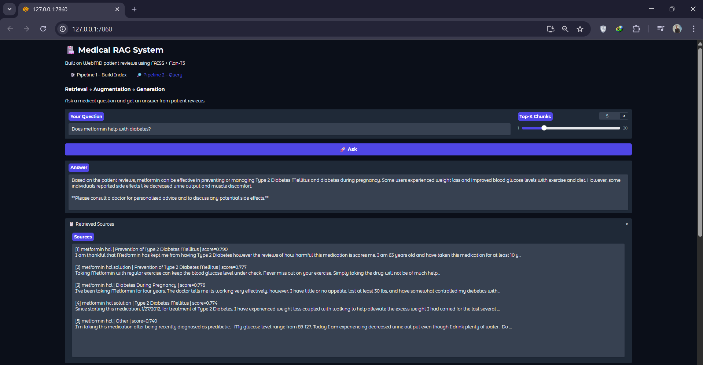

# 💊 WebMD Text Mining & RAG System

A production-style **Retrieval-Augmented Generation (RAG)** pipeline built on real-world patient drug reviews from WebMD. The system mines, chunks, embeds, indexes, and queries over 400,000+ patient reviews to answer natural language medical questions — grounded entirely in real patient experiences.

> ⚠️ *This system is for informational and research purposes only. Always consult a licensed medical professional.*

---

## 🎯 Project Motivation

Patients often search for answers like *"Does metformin help with diabetes?"* or *"What are the side effects of ibuprofen?"* — but generic search engines return generic answers. This project builds a domain-specific QA system that answers such questions using **real patient reviews**, retrieved semantically and synthesized by an LLM.

---

## �️ UI Screenshots

### Build Index

*Build Index*

### RAG Query Interface

*RAG*

---

## 🏗️ System Architecture

```
webmd.csv (raw reviews)
        │
        ▼
┌─────────────────────┐
│  1. Document Loading │  → Load & clean 400K+ rows
└────────┬────────────┘
         │
         ▼
┌─────────────────────┐
│  2. Chunking         │  → Recursive character splitter
│     size=500, overlap=50 chars
└────────┬────────────┘
         │
         ▼
┌─────────────────────┐
│  3. Embedding        │  → all-MiniLM-L6-v2 (384-dim)
│     GPU/CPU auto     │     L2-normalized, batch=512
└────────┬────────────┘
         │
         ▼
┌─────────────────────┐
│  4. FAISS Index      │  → IndexFlatIP (exact cosine search)
│     Store to disk    │     faiss_index.bin + chunks_store.pkl
└────────┬────────────┘
         │
         ▼
┌─────────────────────┐
│  5. Retrieval        │  → Embed query → top-k cosine search
└────────┬────────────┘
         │
         ▼
┌─────────────────────┐
│  6. Augmentation     │  → Build structured prompt with context
└────────┬────────────┘
         │
         ▼
┌─────────────────────┐
│  7. Generation       │  → OpenRouter API (Gemma 4 26B)
│                      │     Fallback: raw retrieved chunks
└─────────────────────┘
```

---

## 📁 Project Structure

```
webmd-textmining-rag/
│
├── document_loading.py     # Step 1: Load & clean raw CSV
├── chunking.py             # Step 2: Recursive text chunker
├── chunk_embedding.py      # Step 3: SentenceTransformer embeddings
├── store_embeddings.py     # Step 4: FAISS index build & search
├── retrieval.py            # Step 5: Query embedding + retrieval
├── augmentation.py         # Step 6: Prompt construction
├── generation.py           # Step 7: LLM generation via OpenRouter
│
├── embeddings.npy          # Saved chunk embeddings (float32)
├── chunks.npy              # Saved chunk objects (numpy array)
├── faiss_index.bin         # Serialized FAISS index
├── chunks_store.pkl        # Chunk metadata store (pickle)
│
├── webmd.csv               # Raw WebMD reviews (~168 MB, Git LFS)
├── merged_insights.csv     # Processed drug insights
├── .env                    # API keys (not committed)
├── .gitattributes          # Git LFS config
├── .gitignore
├── image/
│   ├── Build Index.png
│   └── RAG.png
└── README.md
```

---

## � Pipeline Deep Dive

### Step 1 — Document Loading (`document_loading.py`)
- Loads `webmd.csv` using pandas
- Inspects shape, columns, and missing values
- Drops fully-empty rows
- Columns used: `Drug`, `Condition`, `Age`, `Sex`, `Effectiveness`, `Satisfaction`, `EaseofUse`, `Date`, `Reviews`

### Step 2 — Chunking (`chunking.py`)
- Implements a **recursive character-level splitter** (similar to LangChain's `RecursiveCharacterTextSplitter`)
- Splits on: `\n\n` → `\n` → `. ` → ` ` → characters (fallback)
- **Chunk size**: 500 characters | **Overlap**: 50 characters
- Each chunk carries full metadata: drug name, condition, age, sex, effectiveness, satisfaction, ease of use, date
- Output: list of dicts with `chunk_id`, `text`, and all metadata fields

### Step 3 — Embedding (`chunk_embedding.py`)
- Model: **`all-MiniLM-L6-v2`** (SentenceTransformers)
  - 384-dimensional dense vectors
  - Fast, lightweight, strong semantic performance
- **L2-normalized** embeddings → cosine similarity = dot product
- Auto-detects GPU (CUDA) or falls back to CPU
- Batch size: 512 for efficient throughput
- Supports sampling (default: 50,000 chunks) for CPU environments
- Saves: `embeddings.npy` + `chunks.npy`

### Step 4 — Vector Store (`store_embeddings.py`)
- Index type: **`faiss.IndexFlatIP`** (exact inner product / cosine search)
- No approximation — guarantees exact nearest neighbors
- Persists index to `faiss_index.bin` and metadata to `chunks_store.pkl`
- Exposes a `search(query_embedding, index, chunks, top_k)` utility

### Step 5 — Retrieval (`retrieval.py`)
- `Retriever` class loads the FAISS index + chunk store on init
- Embeds the user query using the same `all-MiniLM-L6-v2` model
- Returns top-k chunks ranked by cosine similarity score
- Default `top_k = 5`

### Step 6 — Augmentation (`augmentation.py`)
- Formats retrieved chunks into a structured context block:
  ```
  [Review 1] Drug: Metformin | Condition: Diabetes | Effectiveness: 4/5 | Satisfaction: 4/5
  <review text>
  ```
- Injects context into a prompt template with a medical system prompt:
  > *"Answer using ONLY the patient reviews provided. Be concise, factual, and always remind the user to consult a doctor."*

### Step 7 — Generation (`generation.py`)
- Calls **OpenRouter API** with model: `google/gemma-4-26b-a4b-it:free`
- Configurable via `.env` (`OPENROUTER_API_KEY`, `OPENROUTER_MODEL`)
- Implements **exponential backoff** retry (up to 5 attempts) on rate limits (HTTP 429)
- **Graceful fallback**: if LLM is unavailable or API key is missing, returns the raw retrieved reviews directly
- Output: `{ query, answer, chunks, prompt }`

---

## 📊 Dataset

### `webmd.csv` *(Git LFS)*
Raw patient drug reviews scraped from WebMD. ~168 MB, tracked via Git LFS.

| Column | Description |
|---|---|
| `Drug` | Drug name |
| `Condition` | Medical condition treated |
| `Age` | Patient age group |
| `Sex` | Patient sex |
| `Effectiveness` | Rating 1–5 |
| `Satisfaction` | Rating 1–5 |
| `EaseofUse` | Rating 1–5 |
| `Date` | Review date |
| `Reviews` | Free-text patient review |

### `merged_insights.csv`
Aggregated drug-level insights extracted via text mining.

| Column | Description |
|---|---|
| `DrugName` | Drug name |
| `Condition` | Most common condition |
| `ConditionCount` | Review count for that condition |
| `SideEffect` | Most reported side effect |
| `SideEffectCount` | Review count for that side effect |
| `SuggestedQuestion` | Auto-generated RAG query |

---

## ⚙️ Tech Stack

| Component | Technology |
|---|---|
| Language | Python 3.10+ |
| Data Processing | pandas, numpy |
| Embeddings | sentence-transformers (`all-MiniLM-L6-v2`) |
| Vector Search | FAISS (`IndexFlatIP`) |
| LLM | Google Gemma 4 26B via OpenRouter API |
| GPU Support | PyTorch (CUDA auto-detect) |
| Serialization | numpy `.npy`, pickle `.pkl`, FAISS `.bin` |
| Environment | python-dotenv |

---

## 🚀 Getting Started

### 1. Install dependencies
```bash
pip install pandas numpy torch sentence-transformers faiss-cpu requests python-dotenv
```
> For GPU: replace `faiss-cpu` with `faiss-gpu`

### 2. Set up environment variables
Create a `.env` file:
```env
OPENROUTER_API_KEY=your_api_key_here
OPENROUTER_MODEL=google/gemma-4-26b-a4b-it:free
```
Get a free API key at [openrouter.ai](https://openrouter.ai)

### 3. Run the pipeline

```bash
# Step 1: Load & inspect data
python document_loading.py

# Step 2: Chunk reviews
python chunking.py

# Step 3: Generate embeddings
python chunk_embedding.py

# Step 4: Build FAISS index
python store_embeddings.py

# Step 5: Test retrieval
python retrieval.py

# Step 6: Test augmentation
python augmentation.py

# Step 7: Full RAG generation
python generation.py
```

---

## 💬 Example Queries

```
"Does metformin help with diabetes?"
"What are the side effects of ibuprofen?"
"I have severe anxiety, what medication works best?"
```

Sample output:
```
Q: Does metformin help with diabetes?

A: Based on patient reviews, metformin is widely used for Type 2 diabetes
   management. Many patients report improved blood sugar control, though
   common side effects include nausea and digestive discomfort, especially
   early in treatment. Always consult your doctor before starting any medication.

Sources (5 reviews):
  [1] Metformin | Diabetes | score=0.912
  [2] Metformin | Type 2 Diabetes | score=0.897
  ...
```

---

## 🗂️ Git LFS

`webmd.csv` exceeds GitHub's 100 MB limit and is tracked via **Git LFS**.

```bash
# Clone with LFS
git lfs install
git clone https://github.com/NourElanany/webmd-textmining-rag.git

# If already cloned without LFS
git lfs pull
```

---

## 👤 Author

**Nour Elanany**  
[GitHub](https://github.com/NourElanany)
